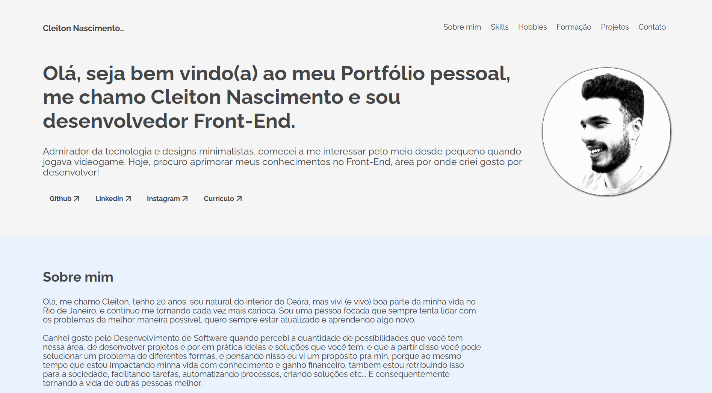
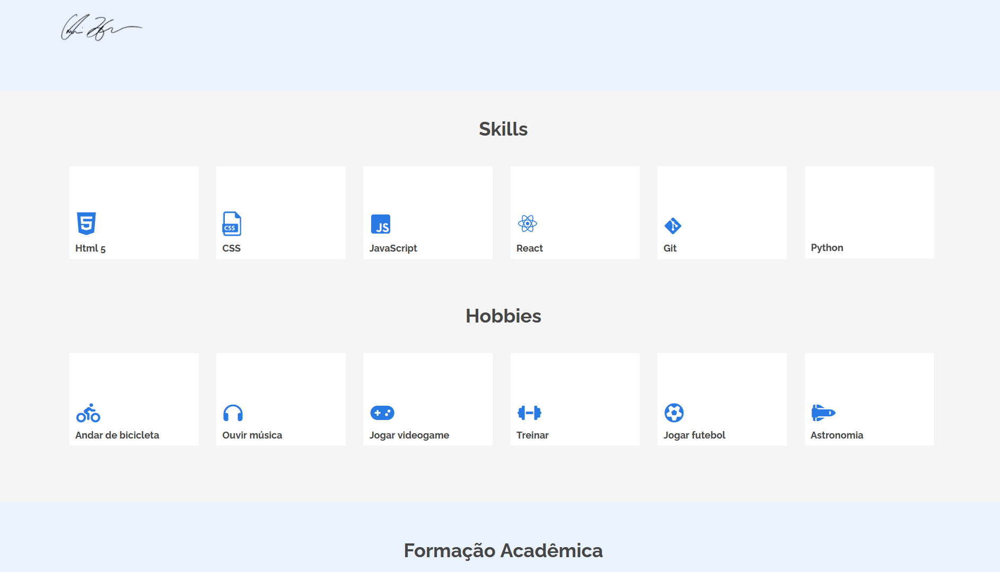

# Sobre o Portfolio_pessoal
Um website do meu portfólio pessoal, contém um pouco sobre min, minhas experiências, cursos e habilidades. Foi desenvolvido durante o Curso Front-End **ONE Next Education**, onde recebemos um design pronto no figma como base e fica aberto a cada pessoa fazer daquela forma ou não, eu decidi fazer o mais próximo possível do design fornecido, até porque essa é uma das tarefas do Front-End no seu dia a dia, e nada melhor do que colocar o conhecimento a prova.

## Apresentação do projeto



## Sobre o desenvolvimento do projeto
Durante o desenvolvimento pude aprimorar minhas habilidades de Front-End utilizando principalmente HTML semântico, EMMET/ CSS, FlexBox, Media-Queries/ Javascript.
Falando um pouco sobre a página, ela contém 6 seções:
```
[1] Uma introdutória onde me apresento e falo sobre minhas paixões
[2] Conto um pouco sobre min
[3] Habilidades/skills e meus hobbies
[4] Formação acadêmica
[5] Experiência profissional e projetos 
[6] Uma sessão de contato
```
Além disso, foi proposto um desafio nesse projeto onde precisávamos validar os campos do formulário de contato, validando se há espaço vazio ou em branco, se estava no limite de caracteres definido, e toda lógica foi implementada no JavaScript. Além do mais, também foi feita validações pelo HTML utilizando algumas propriedades do próprio HTML e o uso do "pattern" para criar uma RegEx. 

### Badge de conclusão do desafio

